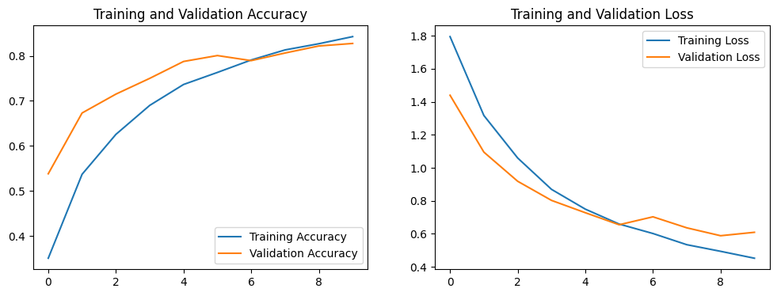
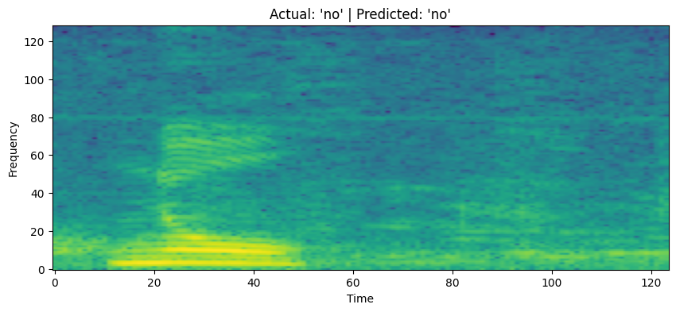

# 🤖 Speech Command Recognition Project

This project is a deep learning model built to understand and classify spoken commands. Using the **Google Speech Commands dataset**, this model can listen to a 1-second audio clip and identify which of 8 words was spoken: "yes", "no", "up", "down", "left", "right", "go", or "stop".

The core of the project involves turning audio waveforms into **spectrograms** (2D images of sound) and then using a **Convolutional Neural Network (CNN)** to perform image classification on these spectrograms.

This project was built and trained entirely in a **Google Colab** notebook.

---

## 🚀 Key Features

* **Audio Preprocessing:** Loads raw `.wav` files, standardizes their length, and converts them into spectrograms using TensorFlow.
* **Deep Learning Model:** Implements a CNN from scratch using `tf.keras.Sequential` to classify the "sound images."
* **Model Training:** Trains the model on 6,400 audio samples and validates it on 1,600 samples, achieving ~85% validation accuracy.
* **Interactive Testing:** Includes code to test the trained model on new, unseen audio files.
* **Live Demo (Experimental):** A (buggy) demonstration of how to hook the model up to a live microphone in Google Colab.

---

## 🛠️ Technology Stack

* **Python 3**
* **TensorFlow & Keras:** For building and training the deep learning model.
* **NumPy:** For numerical operations and data handling.
* **Matplotlib:** For visualizing waveforms, spectrograms, and training results.
* **pydub:** (For the interactive demo) Used to handle audio format conversions.
* **Google Colab:** For the development and training environment.

---

## 📈 Project Results

The model was trained for 10 epochs. It successfully learned to differentiate the commands, achieving a final **validation accuracy of 84.7%**.

The training graphs below show the model's accuracy and loss over time. While the training accuracy (blue) climbs, the validation accuracy (orange) flattens out, indicating some **overfitting**. This could be improved in the future with more data or regularization techniques.

### Training & Validation Plots

**(IMPORTANT: Replace this text and the line below with your own plot!)**
*To get this image, right-click the "Training and Validation" plot in your Colab notebook and "Save Image As...". Then, upload that image to this GitHub repository and edit this file to point to it.*

### Example Prediction

The model demonstrated a high degree of confidence on correct predictions and lower confidence on incorrect ones. Here is an example of a **correct prediction** on a test file:

**(IMPORTANT: Replace this text and the line below with your own plot!)**
*To get this image, right-click your "Actual: 'no' | Predicted: 'no'" plot and "Save Image As...". Upload it and replace this line.*

---

## 📖 How to Use

The easiest way to run this project is to use Google Colab.

1.  **Open in Colab:** Open the `speech_recognition_project.ipynb` file in Google Colab.
2.  **Run All Cells:** In the menu, click `Runtime` -> `Run all`.
3.  **Automatic Setup:** The notebook will automatically:
    * Download and extract the Google Speech Commands dataset.
    * Process all 8,000 audio files.
    * Build the CNN model.
    * Train the model (this will take a few minutes).
4.  **View Results:** The final cells will automatically run the tests, showing you the training plots and example predictions on the validation set.

---

## 🔬 Known Issues & Future Improvements

### Known Issues
* **Microphone Demo Bug:** The live interactive demo (using `predict_from_mic`) is highly unreliable in Google Colab. It creates a "digital pop"—a loud burst of static (e.g., `Raw Audio RMS: 177287104.00`) that corrupts the input. This is a limitation of the Colab environment, not the model itself.

### Future Improvements
1.  **Add a "Silence" Class:** The model is currently forced to "guess" one of the 8 commands, even on silence. The next step would be to train it on the `_background_noise_` folder (included in the dataset) as a 9th class, `_silence_`. This would make the model much more robust in a real-world application.
2.  **Reduce Overfitting:** Implement `Dropout` layers or `L2` regularization to help the validation accuracy track more closely with the training accuracy.
3.  **Use an Upload Feature:** A better interactive demo (as implemented in the notebook) bypasses the "pop" bug by allowing the user to upload their own `.wav` or `.m4a` file, which the model then correctly classifies.
